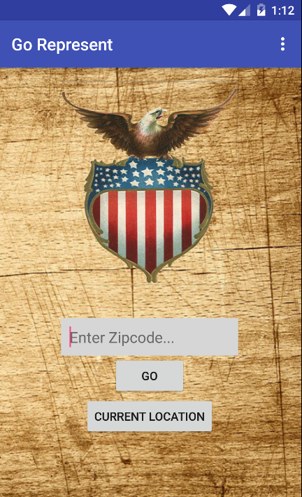
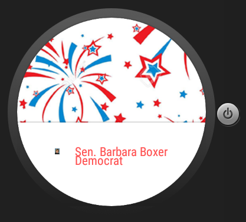
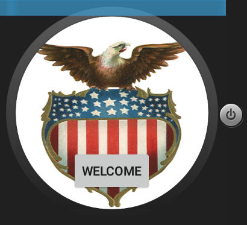
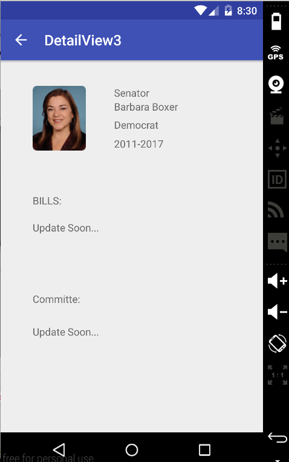
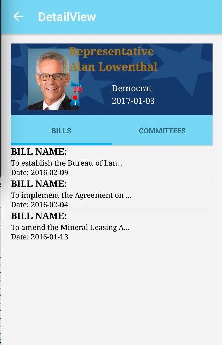
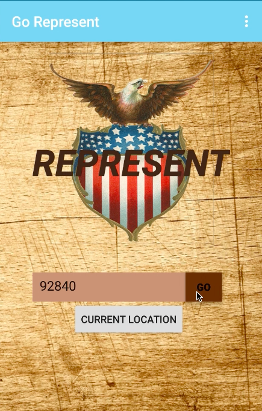

# PROG 02: Represent!

Part B utilize the wireframe of part A to implement the Represent app. The app is like a buletin board telling
user about all senators and House representatives coming from a certain zipcode or in current location

## Authors

FirstName LastName ([phoebevu91@berkeley.edu](mailto:phoebevu91@berkeley.edu))

## Demo Video

See [Prog2B - Represent! Demo] (https://youtu.be/CvcKK8q78Go)

## Screenshots

## Acknowledgments

* Hat tip to anyone who's code was used
* Any other support
