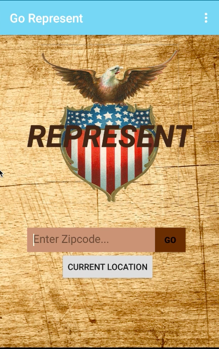
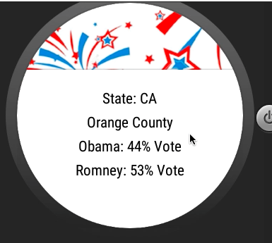
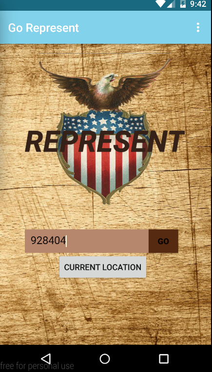

# PROG 02: Represent!

Part C combine the code in part B , the wireframe of part A , and the needed API to implement the Represent app.

The app is like a buletin board telling user about all senators and House representatives coming from a certain zipcode or in current location

## Authors

FirstName LastName ([phoebevu91@berkeley.edu](mailto:phoebevu91@berkeley.edu))

## Demo Video

See [Final Demo] (https://youtu.be/a2FWCPOExCA)

## Screenshots

## Acknowledgments

* Hat tip to anyone who's code was used
StackOverFlow
* Any other support
